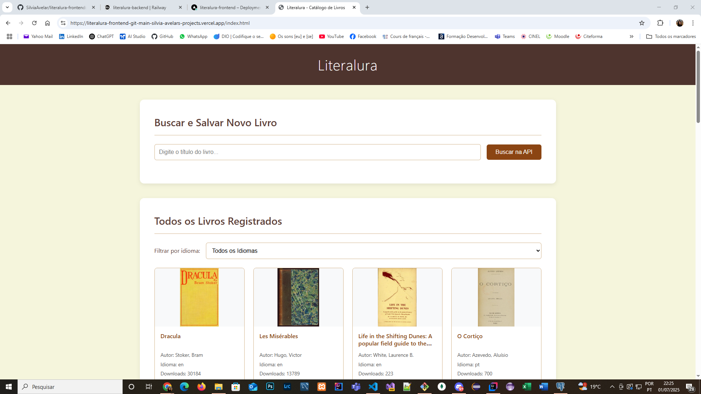
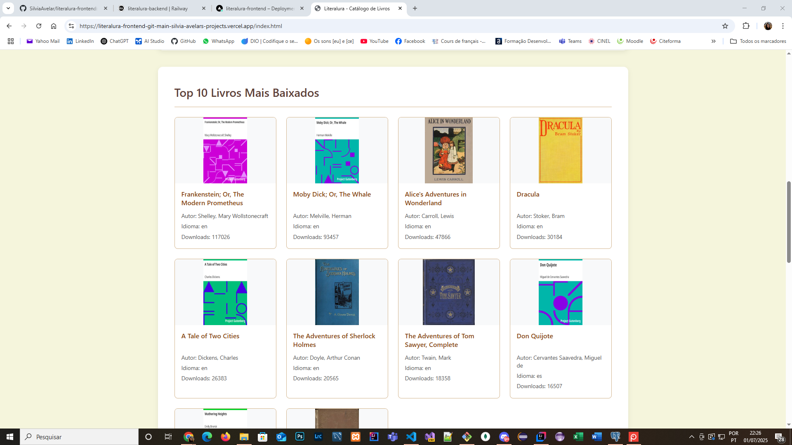
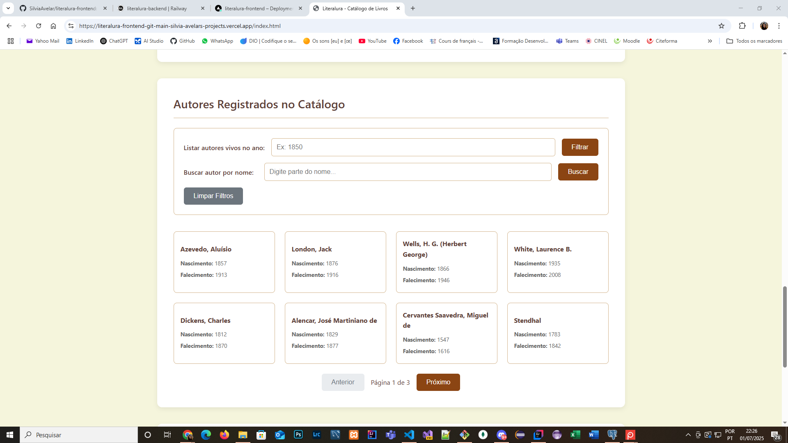
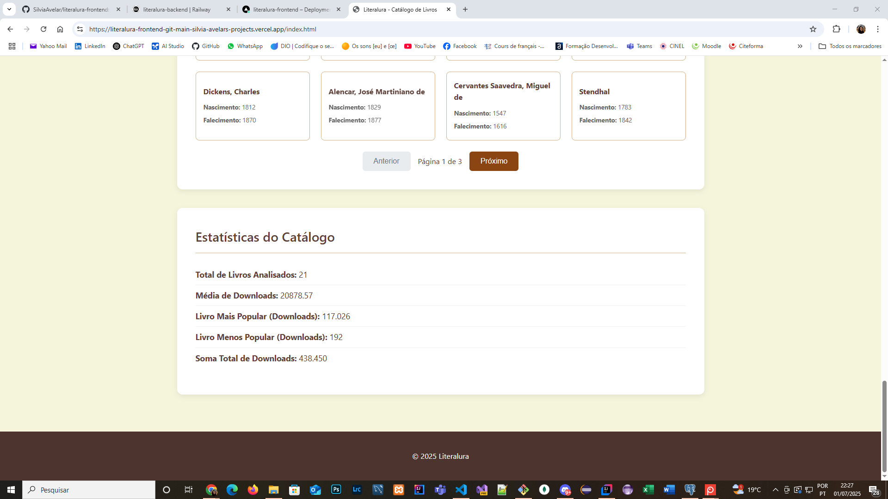

# 📚 Literalura - Frontend

[](https://literalura-frontend-git-main-silvia-avelars-projects.vercel.app)


Este é o **frontend** da aplicação **Literalura**, um catálogo interativo de livros desenvolvido como parte do **Challenge de Back-End da Alura**. A aplicação consome a API RESTful do projeto Literalura Backend e oferece uma experiência rica, moderna e responsiva para os usuários explorarem livros clássicos do *Project Gutenberg*.

🔗 **Acesse o projeto em produção:**  
👉 [https://literalura-frontend-git-main-silvia-avelars-projects.vercel.app](https://literalura-frontend-git-main-silvia-avelars-projects.vercel.app)

---

## 🚀 Funcionalidades

- 🔍 **Busca de Livros:** Pesquise livros diretamente da API do Project Gutenberg e adicione-os ao catálogo.
- 📚 **Listagem Completa:** Visualize todos os livros e autores cadastrados, com paginação.
- 🎯 **Filtros Dinâmicos:** Filtre livros por idioma e busque autores por nome ou por período em que estavam vivos.
- 📖 **Detalhes do Livro:** Veja informações completas do livro, como capa, número de downloads e tópicos.
- ⭐ **Top 10 Livros:** Descubra os 10 livros mais populares com base em downloads.
- 📊 **Estatísticas do Catálogo:** Visualize dados agregados sobre os livros salvos.

---

## 🛠️ Tecnologias Utilizadas

- **HTML5:** Estrutura semântica das páginas.
- **CSS3:** Estilização com uso de variáveis CSS e design responsivo.
- **JavaScript (ES6+):** Lógica da aplicação e manipulação do DOM.
- **Fetch API:** Comunicação assíncrona com o backend.
- **Vercel:** Deploy contínuo e otimizado a partir do GitHub.

---

## 🏗️ Arquitetura do Projeto
```
literalura-frontend/
│
├── index.html # Página principal com listagem e buscas
├── detalhes_livro.html # Página de detalhes de um livro
│
├── css/
│ ├── styles.css # Estilos globais
│ └── detalhes.css # Estilos específicos para página de detalhes
│
├── js/
│ ├── apiService.js # Serviço central de chamadas à API
│ ├── home.js # Lógica da página inicial
│ └── detalhesLivro.js # Lógica da página de detalhes
```

---

## 🌐 Backend Utilizado

Esta aplicação consome uma API REST desenvolvida especificamente para o projeto Literalura.

- **Tecnologias:** Java 17, Spring Boot 3 e PostgreSQL.
- **Hospedagem:** API hospedada na plataforma **Railway**.
- **Repositório do Backend:** [**Acesse o código-fonte da API aqui**](https://github.com/SilviaAvelar/literalura-backend).
- **Arquitetura:** Comunicação totalmente desacoplada entre frontend e backend.

---

## 📸 Preview

<p align="center">
  
  
  
  
</p>

---

## 👩‍💻 Autora

<p align="center">
  
</p>

<p align="center">
  Desenvolvido com 💙 por <strong>Sílvia Avelar</strong>
</p>

<p align="center">
  <a href="https://www.linkedin.com/in/silvia-avelar/" target="_blank">
    
  </a>
  &nbsp;
  <a href="https://silviaavelar.github.io/Portfolio/" target="_blank">
    
  </a>
</p>

Feito com 💙 por **Sílvia Avelar**

---

## 📄 Licença

Este projeto está licenciado sob a **MIT License**.  
Sinta-se à vontade para contribuir ou adaptar!

---